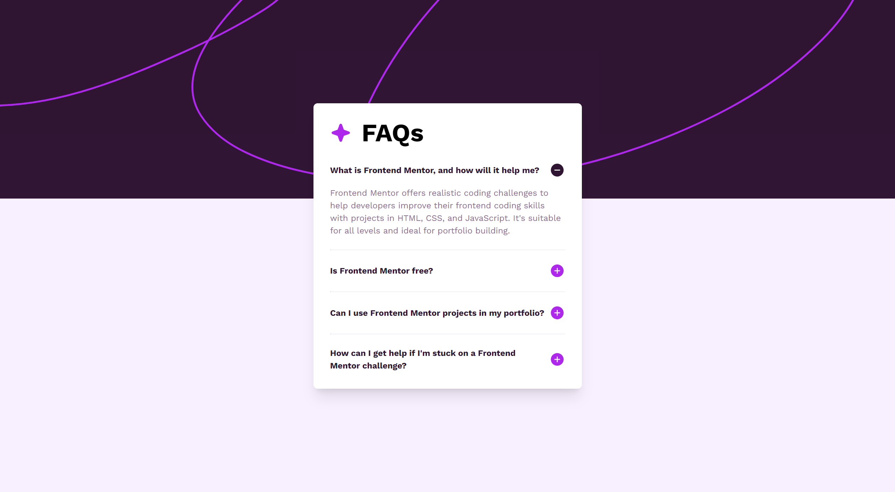

# Frontend Mentor - FAQ accordion solution

This is a solution to the [FAQ accordion challenge on Frontend Mentor](https://www.frontendmentor.io/challenges/faq-accordion-wyfFdeBwBz). Frontend Mentor challenges help you improve your coding skills by building realistic projects.

## Table of contents

- [Overview](#overview)
  - [The challenge](#the-challenge)
  - [Screenshot](#screenshot)
  - [Links](#links)
- [My process](#my-process)
  - [Built with](#built-with)
  - [What I learned](#what-i-learned)
- [Author](#author)

## Overview

### The challenge

Users should be able to:

- Hide/Show the answer to a question when the question is clicked
- Navigate the questions and hide/show answers using keyboard navigation alone
- View the optimal layout for the interface depending on their device's screen size
- See hover and focus states for all interactive elements on the page

### Screenshot



### Links

- Solution URL: [https://stellular-kringle-a110fd.netlify.app](https://stellular-kringle-a110fd.netlify.app)
- Live Site URL: [https://github.com/KH-Ray/faq-accordion](https://github.com/KH-Ray/faq-accordion)

## My process

### Built with

- Semantic HTML5 markup
- CSS custom properties
- Flexbox
- CSS Grid
- [Svelte](https://svelte.dev/) - Free and open-source front-end component framework and language

### What I learned

```svelte
<script>
  import iconPlus from "../assets/icon-plus.svg";
  import iconMinus from "../assets/icon-minus.svg";

  export let faq;
  export let isOpen = false;
</script>

<div class="faq-container">
  <p class="faq-title" on:click={() => (isOpen = !isOpen)}>
    <strong>{faq.title}</strong>
    {#if !isOpen}
      
    {:else}
      
    {/if}
  </p>
  {#if isOpen}
    <p class="faq-content">
      {faq.content}
    </p>
  {/if}
</div>

<style>
  .faq-container {
    font-size: 1.6rem;
    line-height: 2.4rem;
  }

  .faq-title {
    display: flex;
    align-items: center;
    justify-content: space-between;
    gap: 0.4rem;

    color: hsl(292, 42%, 14%);
    font-weight: 600;
    cursor: pointer;
  }

  .faq-title:hover {
    color: #ad28eb;
  }

  .faq-content {
    color: hsl(292, 16%, 49%);
    margin-top: 1.6rem;
  }

  .hidden {
    display: none;
  }
</style>
```

## Author

- Frontend Mentor - [@KH-Ray](https://www.frontendmentor.io/profile/KH-Ray)
